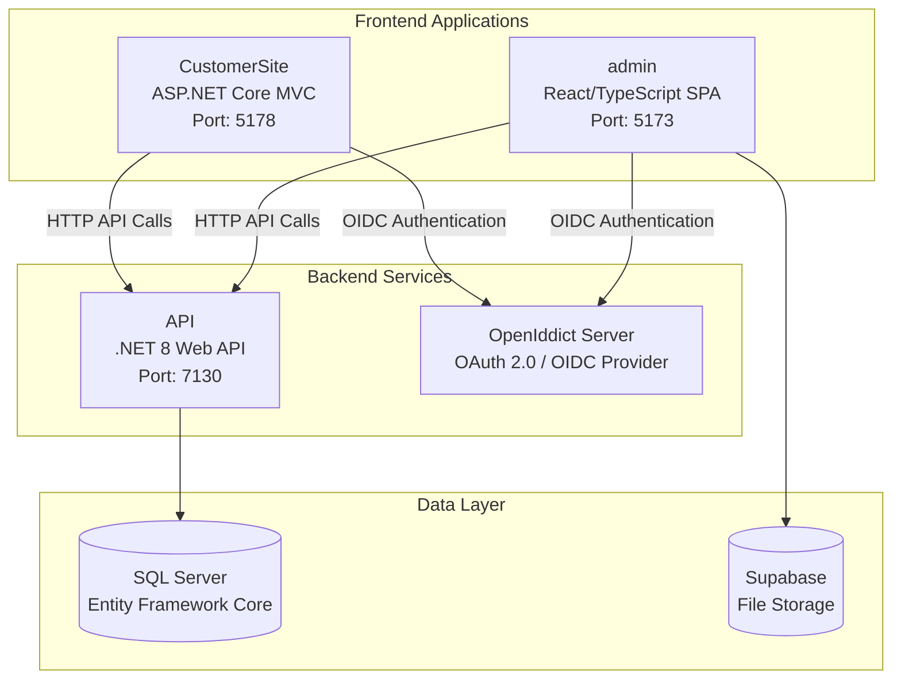

I'll create a comprehensive README.md for the NT-ASSIGNMENT repository based on the codebase context provided.

# NT-PROJECT E-Commerce System

A modern, multi-client e-commerce platform built with .NET 8 and React, featuring centralized authentication through OpenIddict and supporting both customer shopping experiences and administrative management.

## System Architecture

The system follows a distributed architecture with multiple frontend applications communicating with a centralized backend API:



## Technology Stack

### Backend
- **.NET 8** - Web API framework [1](#0-0) 
- **OpenIddict** - OAuth 2.0 / OpenID Connect server [2](#0-1) 
- **Entity Framework Core** - ORM with SQL Server [3](#0-2) 
- **ASP.NET Core Identity** - User management [4](#0-3) 

### Frontend
- **React 18 + TypeScript** - Admin panel SPA
- **ASP.NET Core MVC** - Customer-facing website [5](#0-4) 
- **Tailwind CSS** - Admin panel styling
- **Bootstrap** - Customer site styling

### External Services
- **Supabase** - Image storage and management
- **Google OAuth** - Social authentication
- **Stripe** - Payment processing
- **Email Service** - Account confirmation

## Project Structure

```
src/
├── API/                    # Web API backend
├── Application/            # Business logic services
├── Domain/                 # Entity models
├── Infrastructure/         # Data access & repositories
├── CustomerSite/          # ASP.NET Core MVC frontend
└── SharedViewModels/      # DTOs & contracts

admin/                     # React TypeScript SPA
```

## Authentication & Authorization

The system implements centralized authentication using OpenIddict with support for multiple client applications:

### Client Configurations
- **Admin Web Client** (`admin-web-client`) - React SPA with PKCE [6](#0-5) 
- **Customer Web Client** (`customer-web-client`) - MVC application [7](#0-6) 

### Authentication Schemes
The API supports different authentication schemes for admin and customer contexts [8](#0-7) :
- **AdminScheme** - For administrative users
- **CustomerScheme** - For customer users

### Authorization Policies
Role-based authorization with policies [9](#0-8) :
- `RequireAdminRole` - Admin access only
- `RequireCustomerRole` - Customer access only

## Getting Started

### Prerequisites
- .NET 8 SDK
- Node.js 18+
- SQL Server
- Supabase account (for file storage)

### Backend Setup

1. **Configure Database**
   ```bash
   cd src/API
   dotnet ef database update
   ```

2. **Environment Variables**
   Create `.env` file in the API project root with:
   ```
   DefaultConnection=your_sql_server_connection_string
   ```

3. **Run API**
   ```bash
   dotnet run
   ```
   API will be available at `https://localhost:7130`

### Admin Panel Setup

1. **Install Dependencies**
   ```bash
   cd admin
   npm install
   ```

2. **Environment Configuration**
   Create `.env` file:
   ```
   VITE_API_BASE_URL=https://localhost:7130
   ```

3. **Run Development Server**
   ```bash
   npm run dev
   ```
   Admin panel will be available at `https://localhost:5173`

### Customer Site Setup

1. **Run Customer Site**
   ```bash
   cd src/CustomerSite
   dotnet run
   ```
   Customer site will be available at `http://localhost:5178`

## Key Features

### Admin Panel
- Product management with image upload
- Category administration with attributes
- Customer management and order processing
- Dashboard analytics with data visualization
- Stripe payment integration

### Customer Site
- Product browsing with category filtering
- Shopping cart functionality
- User authentication via OpenIddict
- Order placement and account management

### API Backend
- RESTful endpoints for all business operations [10](#0-9) 
- Embedded OpenIddict server for authentication
- Swagger documentation for API exploration
- Multi-scheme authentication support

## Service Registration

The system uses dependency injection for service management [11](#0-10) :
- Repository interfaces and implementations
- Business logic services
- Authentication services
- Email notification services

## CORS Configuration

The API is configured to accept requests from multiple frontend origins [12](#0-11) :
- `https://localhost:5173` (Admin React SPA)
- `https://localhost:7001` (Alternative admin port)
- `http://localhost:5178` (Customer MVC site)

## Development

### API Documentation
Swagger UI is available at `https://localhost:7130/swagger` in development mode.

### Authentication Flow
The system uses OAuth 2.0 Authorization Code flow with PKCE for the admin panel and standard Authorization Code flow for the customer site [13](#0-12) .

## Notes

This is a comprehensive e-commerce platform demonstrating modern .NET development practices with clean architecture, centralized authentication, and multiple client support. The system is designed for scalability with clear separation between frontend experiences, centralized business logic, and flexible authentication supporting multiple client types.

Wiki pages you might want to explore:
- [System Overview (HoangPhu0705/NT-ASSIGNMENT)](/wiki/HoangPhu0705/NT-ASSIGNMENT#1)
